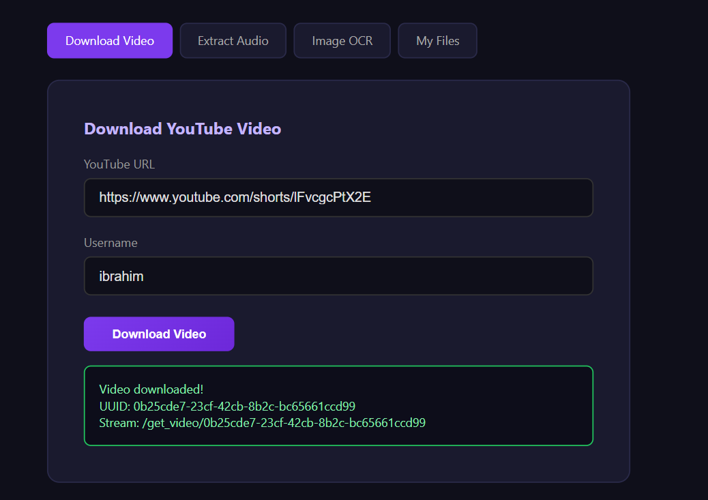
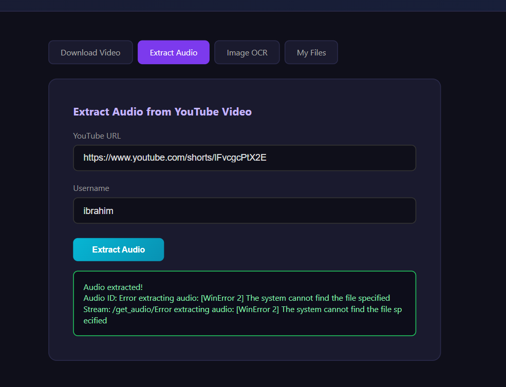
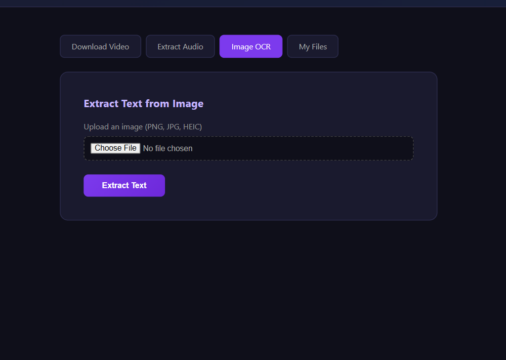
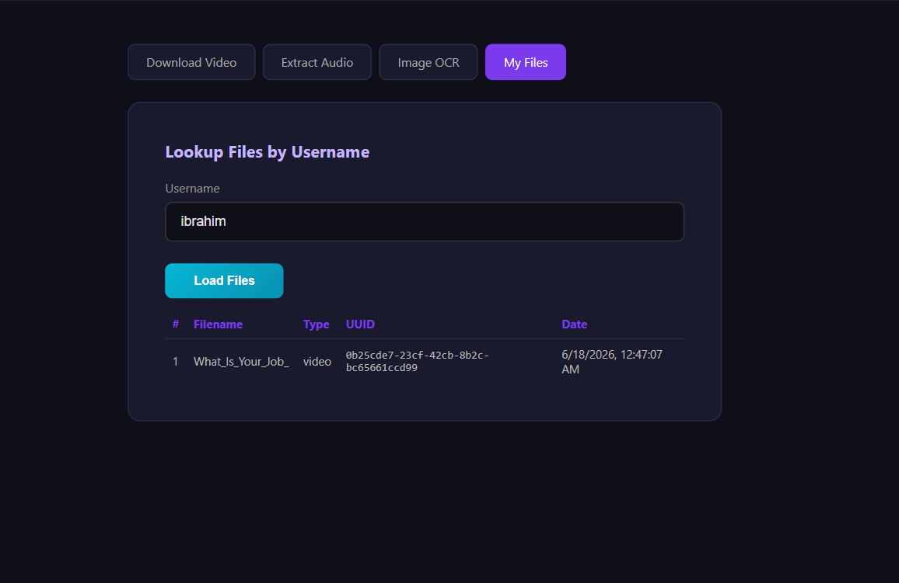

# StreamWorksX – Multimedia Processing Platform

StreamWorksX is a **backend multimedia processing system** designed to automatically process different types of media files including video, audio, and images.

The platform provides APIs for **media processing workflows**, allowing developers to build applications that can download videos, transcribe audio, extract text from images, and process multimedia content efficiently.

StreamWorksX acts as a **central backend service for handling multimedia pipelines**.

---

# Project Overview

Modern applications often require processing large amounts of multimedia data such as videos, audio recordings, and images.

StreamWorksX provides a unified backend system that can:

* Download multimedia content
* Process videos
* Transcribe audio into text
* Extract text from images using OCR
* Expose APIs for media workflows

This system helps automate media processing tasks for developers building **AI, media, and automation platforms**.

---

# Features

* Video downloading and processing
* Audio transcription
* Image text extraction using OCR
* Media processing APIs
* FastAPI backend for scalable API services
* Automated multimedia workflow management

---

# Tech Stack

* Python
* FastAPI
* FFmpeg
* MoviePy
* PyTesseract
* PostgreSQL / Local Storage
* uvicorn (API server)

---

# Prerequisites

Before running the project, make sure the following are installed:

* Python **3.10+**
* Git
* FFmpeg
* Tesseract OCR

### Install FFmpeg

Download from:

https://ffmpeg.org/download.html

After installation verify:

```
ffmpeg -version
```

### Install Tesseract OCR

Download from:

https://github.com/tesseract-ocr/tesseract

Verify installation:

```
tesseract --version
```

---

# Clone the Repository

Clone the project from GitHub.

```
git clone https://github.com/YOUR_USERNAME/streamworksx.git
```

Move into the project directory.

```
cd streamworksx
```

---

# Create Virtual Environment

Create a Python virtual environment.

```
python -m venv .venv
```

---

# Activate Virtual Environment

### Windows

```
.venv\Scripts\activate
```

### Linux / macOS

```
source .venv/bin/activate
```

---

# Install Dependencies

Install required Python packages.

```
pip install -r requirements.txt
```

---

# Run the Application

Start the FastAPI server.

```
python main.py
```

or

```
uvicorn main:app --reload
```

---

# API Documentation

Once the server is running, open the interactive API docs:

```
http://127.0.0.1:8000/docs
```

This allows you to test the APIs directly from the browser.

---

# Project Structure

```
STREAMWORKSX
│
├── audio
│
├── data
│
├── videos
│
├── create_table.py
├── crud.py
├── database.py
├── main.py
├── models.py
├── schemas.py
│
├── .env
├── .gitignore
├── requirements.txt
└── README.md
```

---

# Core Components

### Video Processing

Handles video downloading and manipulation using **FFmpeg** and **MoviePy**.

Example capabilities:

* Download videos
* Convert formats
* Extract audio from video

---

### Audio Transcription

Processes audio files and converts speech into text.

Useful for:

* Podcast transcription
* Video subtitle generation
* Voice-based applications

---

### Image OCR

Uses **PyTesseract** to extract text from images.

Example use cases:

* Document scanning
* Text recognition
* Image-based data extraction

---

### Media APIs

FastAPI endpoints provide services for:

* Uploading media
* Processing multimedia files
* Retrieving results

---

# Development Notes

* Always activate the virtual environment before running the project
* Make sure **FFmpeg** and **Tesseract OCR** are installed on your system
* API endpoints can be tested using `/docs`

---

# Screenshots

### Download Video


### Extract Audio


### Image OCR


### My Files


---

# Future Improvements

* Queue-based media processing
* Background task processing (Celery / Redis)
* Cloud storage integration
* Batch media processing
* Docker deployment

---

# License

This project is open-source and available under the MIT License.
